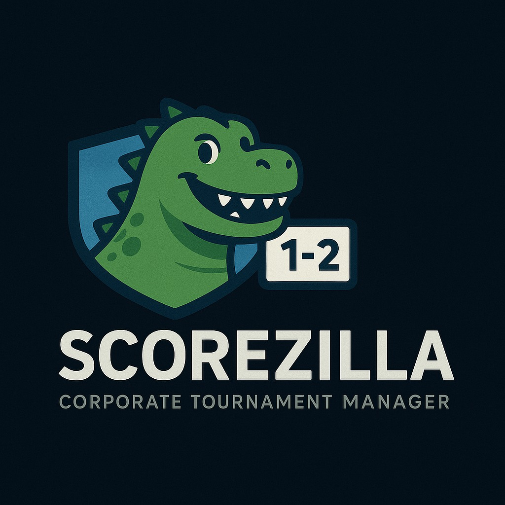
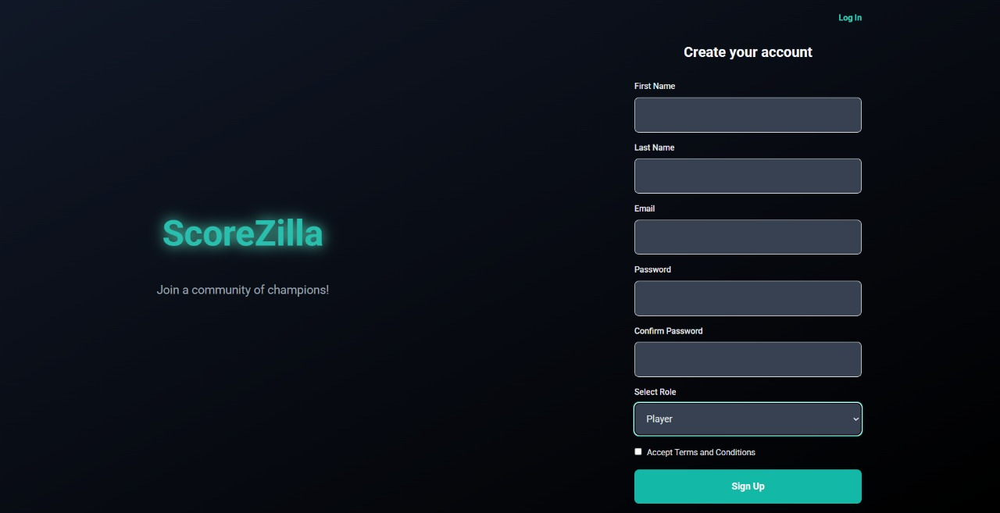
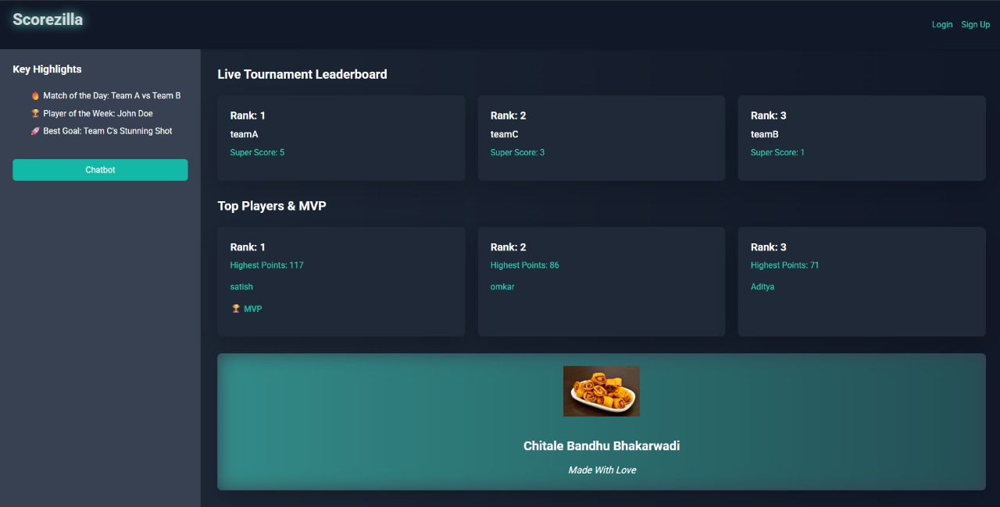
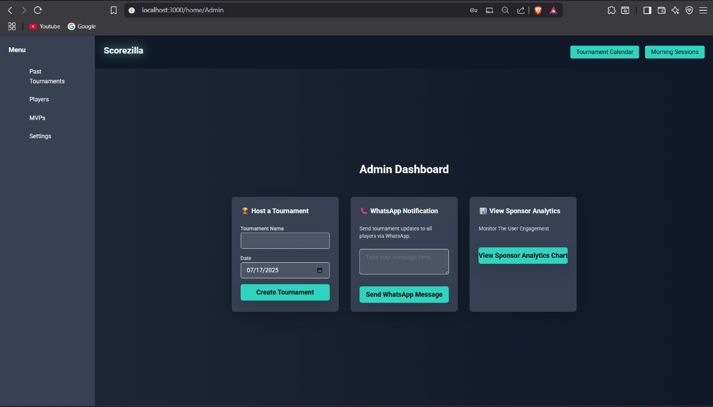
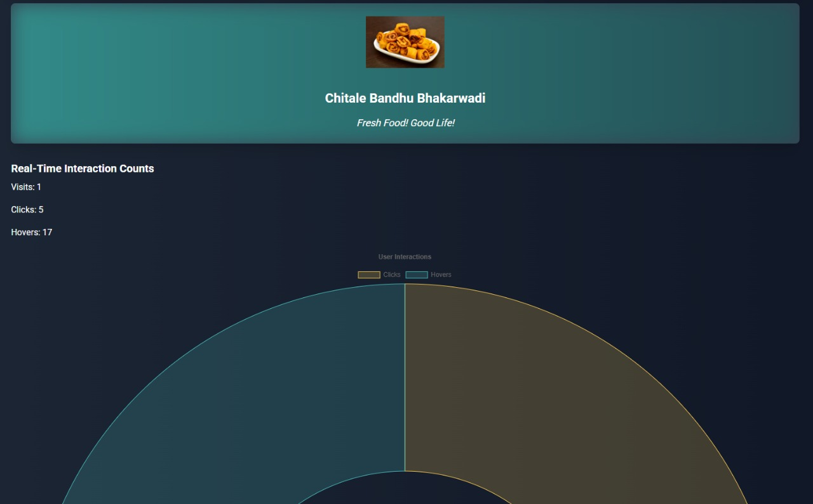
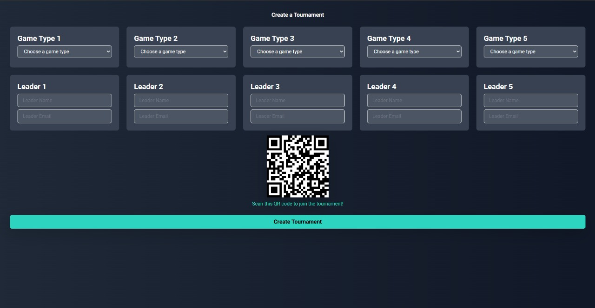
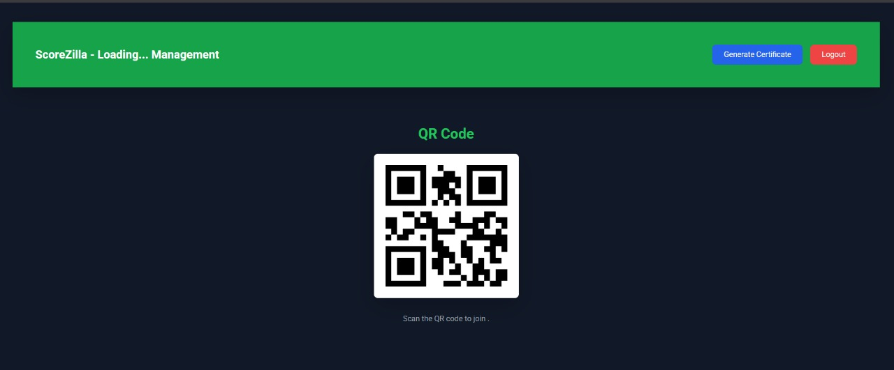
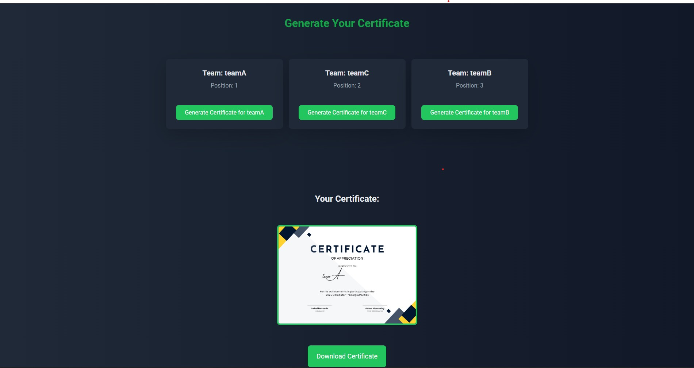
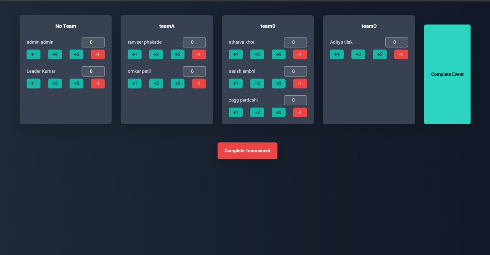

<!-- Logo -->
<p align="center">
  
</p>

# 🏆 Scorezilla - Corporate Sports Tournament Manager

"Your one-stop solution to efficiently manage sports tournaments with real-time leaderboards, seamless registrations, and post-event analytics."

---

## 🔍 About the Project
Scorezilla is a web-based sports tournament management platform designed to simplify the organization and execution of tournaments, especially for corporate or inter-college events.

It eliminates the manual hassles of maintaining spreadsheets and paperwork by offering:
- 📊 Real-time scoreboards
- 🏅 Automated certificate generation
- 📱 QR-based team joining
- 📈 Sponsorship analytics
- ...and more

With three dedicated dashboards — Admin, Judges, and Leaders — Scorezilla ensures every participant, referee, and organizer enjoys a streamlined and engaging tournament experience.

---

## 👨🏻‍💻 Tech Stack Used
| Layer         | Technologies Used                                  |
|--------------|----------------------------------------------------|
| 🎨 Frontend  | ⚛️ React.js, Tailwind CSS                          |
| 🐍 Backend   | Django Framework, 🌐 REST APIs                      |
| 🗄️ Database  | SQLite3 (for development), Django ORM              |
| 📂 Utilities | Postman, GitHub, VS Code, Chart.js, Socket.IO      |

---

## ✨ Features
- 🏅 **Multi-Dashboard Access**: Separate dashboards for Admin, Judges, and Leaders, with customized features based on roles.
- 📲 **QR-Based Team Joining**: Participants can easily join their teams via QR scans, making registrations quick and error-free.
- 🖥️ **Live Leaderboards**: Real-time score updates reflected instantly on the leaderboard interface.
- 📈 **Sponsorship Analytics Dashboard**: Admins can monitor event visibility, engagement stats, and sponsorship reports post-tournament.
- 🏆 **Automated Certificate Generation**: Winners and participants receive dynamically generated certificates with tournament branding.
- 🔐 **Role-Based Authentication & Authorization**: Secure login for different users ensuring access control across the platform.
- 🎮 **Flexible Tournament Formats**: Supports multiple game categories and customizable brackets (knockouts, round-robin, etc.).


---

## 📁 Folder Structure
```
Scorezilla/
  ├── Authorization-Backend/         # Django backend for user management
  │   └── authapi/
  ├── DripSyncFrontend/              # React frontend
  │   └── dripsync/
  │       ├── src/
  │       │   ├── Components/        # React components (pages, charts, dashboards, etc.)
  │       │   └── utils/             # API utilities
  │       └── public/                # Static assets
  │       └── package.json           # Frontend dependencies
  └── README.md                      # Project documentation
```


## 🚀 Getting Started

### Prerequisites
- Node.js (v14 or higher recommended)
- npm (v6 or higher)
- Python 3.x (for Django backend)

### 1. Clone the Repository
```
git clone <repo-url>
cd Scorezilla
```

### 2. Install Frontend Dependencies
```
cd DripSyncFrontend/dripsync
npm install
```

### 3. Start the Frontend
```
npm start
```
This runs the React app on [http://localhost:3000](http://localhost:3000).

### 4. Start the Real-Time Analytics Backend (Socket.IO Server)
In a new terminal:
```
cd DripSyncFrontend/dripsync/src/Components
npm install express cors socket.io
node Server.js
```
This starts the backend server on [http://localhost:3001](http://localhost:3001).

> **Note:** The backend server is required for real-time sponsor analytics. Make sure it is running whenever you want to use the analytics chart.

### 5. Start the Django Backend
(Instructions depend on your Django setup, e.g. in `Authorization-Backend`)
```
cd Authorization-Backend/authapi
pip install -r requirements.txt
python manage.py migrate
python manage.py runserver
```
This starts the main API backend on [http://localhost:8000](http://localhost:8000).

---

## 📈 Sponsor Analytics Chart
- The sponsor analytics chart shows real-time user interactions (clicks and hovers) with sponsor advertisements.
- **Accessible at:**
  - `/leaderboard` (for all users)
  - `/admin/chart` (for admins, via the Admin Dashboard button)

---

## 🖼️ Demo & Screenshots

### 1️⃣ Registration (Role Selection)

<br>Upon registration, users can select from three roles: Admin, Judge, or Leader. This ensures each user gets a tailored dashboard and access to features relevant to their responsibilities in the tournament.

### 2️⃣ Leaderboard (Public Access)

<br>The leaderboard is accessible to everyone, even without logging in. It displays real-time scores and rankings, ensuring transparency and excitement for all participants and viewers.

### 3️⃣ Admin Dashboard

<br>Admins can add new tournaments, manage events (like morning Yoga or Zumba sessions via the top corner), and send WhatsApp notifications to leaders for quick communication and updates.

### 4️⃣ Sponsorship Analytics

<br>This dashboard provides a pie chart showing real-time analytics: how many times sponsor images were hovered over and how many times they were actually clicked, helping sponsors measure engagement.

### 5️⃣ Admin Setting Tournament

<br>Admins can configure tournament details, set up events, and manage all aspects of the tournament from this interface.

### 6️⃣ Leader Dashboard (QR Code Team Joining)

<br>Leaders can generate a QR code for their team. Instead of registering each player manually, teammates can simply scan the QR code to join the team, making onboarding fast and error-free.

### 7️⃣ Certificate Generation

<br>After the tournament, teams can generate and download branded certificates as PDFs, providing official recognition for winners and participants.

### 8️⃣ Judge Dashboard

<br>Judges can mark and score each team based on tournament IDs, streamlining the scoring process and ensuring accurate, real-time updates to the leaderboard.

---

## 🔮 Future Scope
Some potential future improvements and scalability ideas include:
- 📅 Calendar View with Match Notifications: Integrating reminders for upcoming matches via email or SMS.
- 🏟️ Bracket Visualizer: Real-time bracket displays for knockout and group stages.
- 🌐 Cloud Database Integration (AWS/GCP): To handle larger events with thousands of participants.
- 📊 Enhanced Analytics Module: AI-driven performance tracking for players and teams.
- 🤳 Mobile App Version: Companion app for easy score updates and live viewing on the go.
- 🎥 Live Streaming Integration: Allowing users to stream matches via YouTube or internal streaming services.

---

## 🙌 Credits & Acknowledgements
👨‍💻 This project was developed as part of an academic mini-project, aiming to bring digital transformation to local sports events.

🏢 The inspiration came from managing college sports events, noticing recurring organizational challenges and the need for smoother digital solutions.

📚 Icons, UI inspirations, and open-source component libraries referenced from React.js Community, Tailwind UI, and Django REST Documentation.

📌 *This project is open for collaborations or discussions — feel free to connect via [GitHub](https://github.com/Somzee5) or [LinkedIn](https://www.linkedin.com/in/soham-patil-344aa1264/)!*

---

